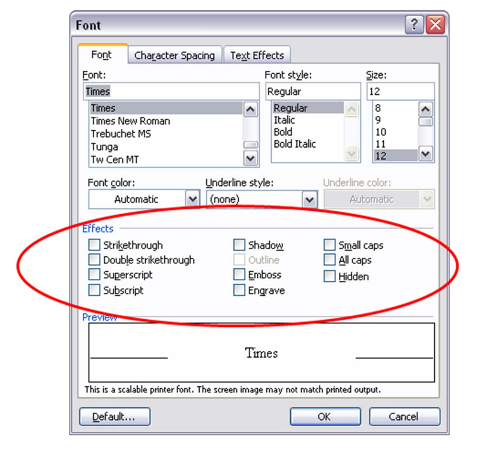
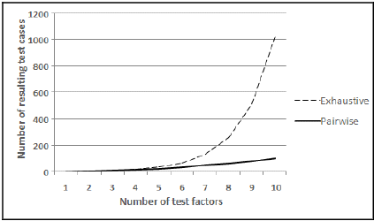

name: title
class: middle, center
# Pairwise & Property-Based Testing

Agustín Ramos

@MachinesAreUs

---
# .center[Así que ya te decidiste a hacer pruebas automatizadas...]
--

+ Unitarias
--

+ De integración
--

+ De aceptación / funcionales
--

+ De desempeño
--


.center.highlight[Solo tengo algo que decir...]

---
class: bottom
background-image: url(./img//daftpunktocat-thomas.gif)
--
# .right[Yarrrr so cool!]

---
class: center, middle
# Ya te vi

---
class: center, middle
# Algún día...

---
class: bottom, right
background-image: url(./img//dojocat.jpg)
# Tú...

---

# .center[¿Qué dificultades te has encontrado al implementar pruebas?]
--

+ Toma su tiempo
--

+ Requiere el uso de varios frameworks y técnicas
--

+ Aumenta la cantidad de código a escribir *
--

+ Hace que el 'build' sea más lento
--

+ etc, etc...
---
# .center[¿Y qué pasa si no automatizas pruebas?]
--

Para probar una función/método:

--

+ Tengo que levantar toda la aplicación/ambiente

--

+ Tengo que seguir el flujo que me lleva a la llamada a mi función/método

--

+ Depende de las configuraciones de mi máquina

--

.center.highlight[Ahora imagina... lo mismo para todas las funciones del sistema] 

---
class: center, middle
# El problema del testing

---
# Ejemplo 1

¿Cuántos diferentes casos de prueba se necesitan para probar ésta interfaz?

.center[]


---
# Ejemplo 2

¿Cuántos casos de prueba se necesitan para probar ésta función?

```javascript
function partition(items, left, right) {
    var pivot = items[Math.floor((right + left) / 2)],
        i     = left,
        j     = right;
    while (i <= j) {
        while (items[i] < pivot) { i++; }
        while (items[j] > pivot) { j—; }
        if (i <= j) {
            swap(items, i, j);
            i++;
            j--;
        }
    }
    return i;
}
```

.right[[Javascript Quicksort](http://www.nczonline.net/blog/2012/11/27/computer-science-in-javascript-quicksort/)]

---
# Ejemplo 2

¿Cuántos **tipos de prueba** se necesitan para probar ésta función?

```javascript
function partition(items, left, right) {
    var pivot = items[Math.floor((right + left) / 2)],
        i     = left,
        j     = right;
    while (i <= j) {
        while (items[i] < pivot) { i++; }
        while (items[j] > pivot) { j—; }
        if (i <= j) {
            swap(items, i, j);
            i++;
            j--;
        }
    }
    return i;
}
```

---
# Ejemplo 2

¿Cuántos **tipos de prueba** se necesitan para probar ésta función?

--

+ Valores en rangos esperados

--

+ Valores no esperados (Indices fuera de rango, nulos)

--

+ Condiciones de frontera (arreglo vacío, arreglo de tamaño máximo)

--

+ **Valores que ejerciten las distintas rutas de ejecución**

---
# Ejemplo 2

¿Cuántos **rutas de ejecución** tiene ésta función?

```javascript
function partition(items, left, right) {
    var pivot = items[Math.floor((right + left) / 2)],
        i     = left,
        j     = right;
    while (i <= j) {
        while (items[i] < pivot) { i++; }
        while (items[j] > pivot) { j—; }
        if (i <= j) {
            swap(items, i, j);
            i++;
            j--;
        }
    }
    return i;
}
```
---
# Complejidad Ciclomática

--

+ Métrica.

--
+ Thomas J. McCabe, 1976

--

+ Mide el número de rutas de ejecución linealmente independientes dentro de un programa.

--
+ Aproximador 

.center[2^N - 1] 

--

.center[N es el número de bifurcaciones en el código (bloques if, where, for, etc.)]

---
# Ejemplo 2

¿Cuántos **rutas de ejecución** tiene ésta función?

```javascript
function partition(items, left, right) {
    var pivot = items[Math.floor((right + left) / 2)],
        i     = left,
        j     = right;
*    while (i <= j) {
*        while (items[i] < pivot) { i++; }
*        while (items[j] > pivot) { j—; }
*        if (i <= j) {
            swap(items, i, j);
            i++;
            j--;
        }
    }
    return i;
}
```
--

.center[2^4 = **16**]

--

.center[Necesitas 16 distintos casos de prueba, solo para saber que pasaste por todas las rutas de ejecución posibles]

---
class: center, middle
# Ojo: 
# ¿Por qué escribir código si no estás seguro que se debe ejecutar?

---
class: center, middle
# Corolario:
# Entre menos código escribas y más sencillo sea, es más fácil saber que funciona

---
class: center, middle
# El problema 
# es la explosión combinatorial 

---
class: bottom, right
background-image: url(./img/combinatorial-explosion.jpg)
--

# El PExC

---
class: center, middle
# ... y hay quienes además, quieren seguir haciéndolo a mano.

---
class: center, middle
# Pairwise Testing

---
# .center[Pairwise Testing]


Idea central: 

--

> Es una **técnica de generación de casos de prueba** que se basa en la **observación** de que **la mayoría de los defectos (~90%) son causados por interacciones de a lo más dos factores** de prueba.

--

> Con ésta técnica **se generan todas las posibles combinaciones de dos valores distintos** para cada factor de prueba y por tanto, **las suites de pruebas son mucho más pequeñas que las generadas de manera exhaustiva** y aún así son muy efectivas para encontrar defectos.

---

# Ejemplo

.center[Tienes que probar un componente web que debe correr en distintos navegadores (**Chrome y Firefox**), distintos sistemas operativos (**OSX, Linux, Windows**) y con diferentes capacidades de memoria de video (**500Mb y 1Gb**).]

--

.center[¿Cuántas posibles configuraciones tienes que probar?]

--

.center[**Con pairwise testing son 6**]

--
<center>
<table>
<tr><th>Browser</th><th>OS     </th><th>Video Memory</th></tr>
<tr><td>Chrome </td><td>Windows</td><td>500Mb       </td></tr>
<tr><td>Chrome </td><td>Linux  </td><td>1Gb         </td></tr>
<tr><td>Chrome </td><td>OSX    </td><td>1Gb         </td></tr>
<tr><td>Firefox</td><td>Windows</td><td>1Gb         </td></tr>
<tr><td>Firefox</td><td>Linux  </td><td>500Mb       </td></tr>
<tr><td>Firefox</td><td>OSX    </td><td>500Mb       </td></tr>
</table>
</center>

---
class: center
# .center[Pairwise testing vs Exhaustive testing]



[Pairwise Testing in the Real World](https://msdn.microsoft.com/en-us/library/cc150619.aspx)

---
class: center, middle
# Property Based Testing


---
# Property Based Testing

+ Es una técnica complementaria a unit testing.

--
+ La idea es especificar un conjunto de propiedades que siempre se deben cumplir (invariantes).

--
+ El framework genera un conjunto de ejemplos 'aleatorios' contra los cuales probar si la propiedad se cumple o no.

--
+ Si encuentra un ejemplo que invalida la propiedad, trata de reducirlo a su mínima expresión. 

---
# .center[Quick Check - Ejemplo 1]

Vamos a verificar si una función que implementa el reverso de una cadena cumple ciertas propiedades.

--

**Propiedad 1**: El reverso del reverso de una cadena, es la misma cadena.

--
```haskell
ghci> quickCheck (\s -> reverse(reverse s) == s)
+++ OK, passed 100 tests.
```
--

**Propiedad 2**: El reverso de una cadena, tiene la misma longitud que la cadena original.

--
```haskell
ghci> quickCheck (\s -> length(reverse s) == length s)
+++ OK, passed 100 tests.
```
--
**Propiedad 3**: El reverso de una cadena palíndroma, es la misma cadena.

--
```Haskell
ghci> quickCheck (\s -> isPalindrome s ==> reverse s == s)
+++ OK, passed 100 tests.
```

---
# .center[Quick Check - Ejemplo 2]

La siguiente máquina de estados acepta todas las cadenas cuyo número de `0` es par.

.center[]

--
La función 'decide' decide si el autómata acepta la cadena o no. Ejemplos:

.center[`decide "00100" == True`]
.center[`decide "00110" == False`]

---
#.center[Quick Check - Ejemplo 2]

**Propiedad 1**: `decide` debe regresar solo `True` o `False`.

--
```Haskell
ghci> quickCheck (\s -> decide s `elem` [True, False])
+++ OK, passed 100 tests.
```
--
**Propiedad 2**: `decide` sólo acepta cadenas con un númpero par de 0's.

--
```Haskell
ghci> quickCheck (\s -> isEvenZeros s == decide s)
+++ OK, passed 100 tests.
```

---
# .center[¿Y Java apá ?]

--

Mira mijo...

--
+ Hay varios frameworks

--
+ Ninguno me gusta

--
+ Pero da un vistazo a
  - [Junit Theories](https://github.com/junit-team/junit/wiki/Theories)

--
  - [Quickcheck](https://bitbucket.org/blob79/quickcheck) 
--

+ Y si eres más atrevido, prueba [ScalaCheck](https://www.scalacheck.org/)

---
# .center[JUnit Theories 1/2] 

```java
@Theory
public void multiplyIsInverseOfDivideWithInlineDataPoints(
    @Between(first = -100, last = 100) int amount,
    @Between(first = -100, last = 100) int m) 
{
    assumeThat(m, not(0));
    assertThat(new Dollar(amount).times(m).divideBy(m).getAmount(), is(amount));
}
```

---
# .center[JUnit Theories 2/2]

```java
@Retention(RetentionPolicy.RUNTIME)
@ParametersSuppliedBy(BetweenSupplier.class)
public @interface Between {
    int first();

    int last();
}

public static class BetweenSupplier extends ParameterSupplier {
    @Override
    public List getValues(Object test, ParameterSignature sig) {
        Between annotation = (Between) sig.getSupplierAnnotation();

        ArrayList list = new ArrayList();
        for (int i = annotation.first(); i <= annotation.last(); i++)
            list.add(i);
        return list;
    }
}
```
---
class: middle, center
# ¿Otros lenguajes?
--

# .center[¡Claro!]
--

# .center[Google for it!!!]

---
background-image: url(./img//tabla.jpg)
class: background-right
# Resúmen
--

+ Hacer pruebas es difícil

--

+ Si no las haces... tabla

--

+ Si no las automatizas... tabla

--
+ Hacer buenas pruebas es aún más difícil

--

+ Si no estudias y te aplicas... tabla

--

+ ¡pero no hay de otra!

  - Salvo vivir en la incertidumbre...

---
# Más información

+ [Property Based Testing (video by @jessitron)](http://www.infoq.com/presentations/property-based-testing)

--

+ [Pairwise testing (community website)](http://www.pairwise.org/)

--

+ [Combinatorial Software Testing (article)](http://csrc.nist.gov/groups/SNS/acts/documents/kuhn-kacker-lei-hunter09.pdf)

--

+ [Better than unit tests (article)](http://thinkrelevance.com/blog/2013/11/26/better-than-unit-tests) 

--

+ **[Practical Combinatorial Testing (NIST Report)](http://csrc.nist.gov/groups/SNS/acts/documents/SP800-142-101006.pdf)**

---
class: center, middle
# ¡Happy Testing!

Agustín Ramos

@MachinesAreUs
